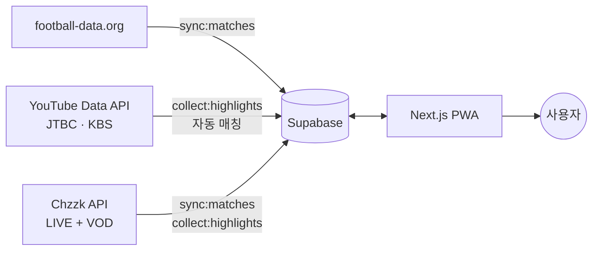

<div align="center">

# lighthigh ⚽

**흩어진 월드컵 하이라이트를, 일정표에서 한 번의 탭으로.**

2026 FIFA 월드컵 경기 일정을 모바일에서 한 눈에 보고, 하이라이트로 바로 연결합니다.


</div>

## 무엇을 해결하나

한국에서 월드컵 파생영상 권한은 네이버(치지직)뿐이고, 하이라이트는 **치지직·JTBC·KBS 유튜브**에 흩어져 있어 매번 검색하는 "추가 사이클"이 필요합니다. lighthigh는 **일정 → 하이라이트**를 한 동작으로 잇고, 시청 후 보던 위치로 매끄럽게 복귀시킵니다.

## 핵심 기능

- 📅 **날짜별 경기 일정** — KST 기준, 달력형 날짜 스트립(좌우 화살표·스크롤), 라운드/조·국기·스코어
- ▶️ **하이라이트 바로보기** — 임베드 가능 영상은 인앱 재생, 그 외/치지직은 외부 딥링크. 다수 하이라이트는 목록 스크롤
- 🔴 **LIVE 경기 자동 상단 노출** — 진행 중인 경기가 날짜 그룹 최상단으로 올라오고, 치지직 중계 버튼 자동 노출
- 🙈 **스포일러 가림** — 점수를 기본 블러 처리, "결과 보기"로 공개(카드·팝업 동기화), 상단 토글로 일괄 전환
- 🔁 **매끄러운 왕복** — SPA 라우팅 + 스크롤 복원, 외부 이동 후 보던 자리로 복귀
- 📱 **모바일 우선 + PWA** — 홈 화면 추가, "Cloud Dancer"(PANTONE 2026) 라이트 테마

## 기술 스택

- **Next.js 16** (App Router) · React 19 · TypeScript · Tailwind CSS v4 · NanumSquare
- **Supabase** (Postgres + RLS) — 일정/하이라이트 저장
- 데이터: **football-data.org**(일정/결과, 무료) · **YouTube Data API v3**(하이라이트 수집) · **Chzzk API**(LIVE 자동 연결 + VOD 수집)

## 아키텍처



- **일정 동기화**: football-data WC 경기/결과 → `matches`/`teams` upsert (5분 크론, 활성 경기 구간에만 실행)
- **하이라이트 수집**: 공식 채널 업로드 → 키워드 필터 → 제목의 팀명으로 경기 **자동 매칭** → 임베드 여부 확인 → `highlights`(매칭)/`highlight_candidates`(미매칭). 킥오프 3h~16h 구간에만 실행
- **치지직 LIVE 연결**: `search/lives`로 "월드컵" 라이브 검색 → verifiedMark 공식 채널만 필터 → 현재 LIVE 경기에 자동 연결, 종료 시 해제 (해외 IP geo-block 우회)
- **반자동 운영**: 자동 수집 + 관리자 검토/교정으로 정확도 확보

## 빠른 시작

```bash
pnpm install
cp .env.local.example .env.local   # 키 입력 (아래 표 참고)
pnpm dev                            # http://localhost:3000
```

Supabase 스키마는 [`supabase/schema.sql`](supabase/schema.sql)을 SQL Editor에 붙여넣어 적용합니다.
키가 없으면 `lib/mock-data.ts`의 목 데이터로 UI가 동작합니다.

### 환경 변수

| 변수 | 설명 |
|---|---|
| `FOOTBALL_DATA_TOKEN` | football-data.org API 토큰(일정/결과) |
| `YOUTUBE_API_KEY` | YouTube Data API v3 키(하이라이트 수집) |
| `NEXT_PUBLIC_SUPABASE_URL` | Supabase 프로젝트 URL |
| `NEXT_PUBLIC_SUPABASE_ANON_KEY` | Supabase anon 키(공개 읽기) |
| `SUPABASE_SERVICE_ROLE_KEY` | Supabase service_role 키(서버 쓰기 권한) |

### 스크립트

| 명령 | 설명 |
|---|---|
| `pnpm dev` / `build` / `start` | 개발 / 빌드 / 프로덕션 |
| `pnpm lint` | ESLint |
| `pnpm verify:sources` | 데이터 소스 점검(WC 일정·임베드 가능 비율) |
| `pnpm sync:matches` | football-data → Supabase 일정 동기화 |
| `pnpm collect:highlights` | YouTube 하이라이트 수집·자동 매칭 |

## 문서

- [`docs/PRD.md`](docs/PRD.md) — 제품 요구사항
- [`docs/wireframe.md`](docs/wireframe.md) — 모바일 와이어프레임·화면 흐름

## 라이선스

[MIT](LICENSE) © ingeun92

> 영상은 재호스팅 없이 공식 출처로 **링크·임베드만** 제공합니다. YouTube/치지직 약관 및 중계권 정책을 준수하세요.
